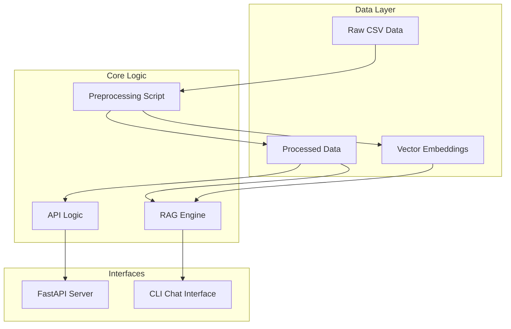
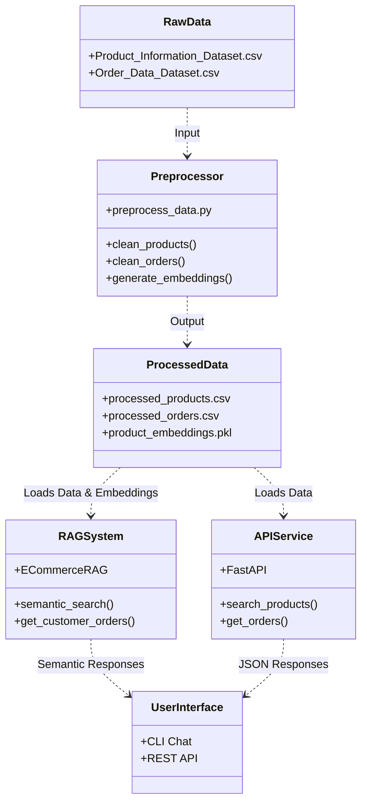

# System Architecture

This document outlines the system architecture of the E-Commerce RAG Chatbot project, including its components, data flow, and data lineage.

## System Overview

The E-Commerce RAG Chatbot is designed to provide intelligent product search and order management capabilities. The system operates in two main modes:
1.  **REST API**: A FastAPI-based service providing structured access to product and order data using keyword search and filtering.
2.  **RAG Chat Interface**: A CLI-based conversational assistant that uses Retrieval-Augmented Generation (RAG) principles and semantic search to answer natural language queries.

## Architecture Diagram

## Data Lineage

The following UML diagram visualizes the data lineage from raw sources to the final user interfaces.

## Component Details

### 1. Data Layer
*   **Raw Data**: Located in `data/raw/`, containing original CSV files for products and orders.
*   **Preprocessing**: The `scripts/preprocess_data.py` script is the ETL pipeline. It:
    *   Cleans and normalizes text fields.
    *   Converts data types (prices, dates).
    *   Generates vector embeddings for product descriptions using `sentence-transformers`.
*   **Processed Data**: Stored in `data/processed/` for efficient loading by the application.

### 2. RAG Engine (`src/rag/`)
*   **Core Logic**: Implemented in `assistant.py`.
*   **Functionality**:
    *   Loads processed CSVs and pickle files.
    *   Performs **semantic search** by encoding user queries and calculating cosine similarity with product embeddings using `sentence-transformers`.
    *   Handles order queries by filtering the order DataFrame.
    *   **Generates natural language responses** using Google's Gemini LLM (gemini-2.5-flash).
    *   Falls back to template-based responses if the API key is not configured.
*   **LLM Integration**:
    *   Uses `google-generativeai` SDK to interact with Gemini.
    *   Constructs prompts with user query and retrieved context.
    *   Returns conversational, context-aware responses.

### 3. API Service (`src/api/`)
*   **Framework**: FastAPI.
*   **Endpoints**:
    *   `/products`: Supports keyword search, category filtering, and sorting.
    *   `/orders`: Retrieves orders by customer ID or priority.
*   **Logic**: Directly queries the processed Pandas DataFrames. Note that the current API implementation uses keyword matching (`str.contains`) rather than the semantic search used by the RAG assistant.

### 4. Interfaces
*   **CLI Chat**: An interactive command-line tool (`scripts/chat.py`) that interfaces with the RAG engine to simulate a chatbot experience.
*   **Swagger UI**: Auto-generated API documentation available at `http://localhost:8000/docs` when running the API.
