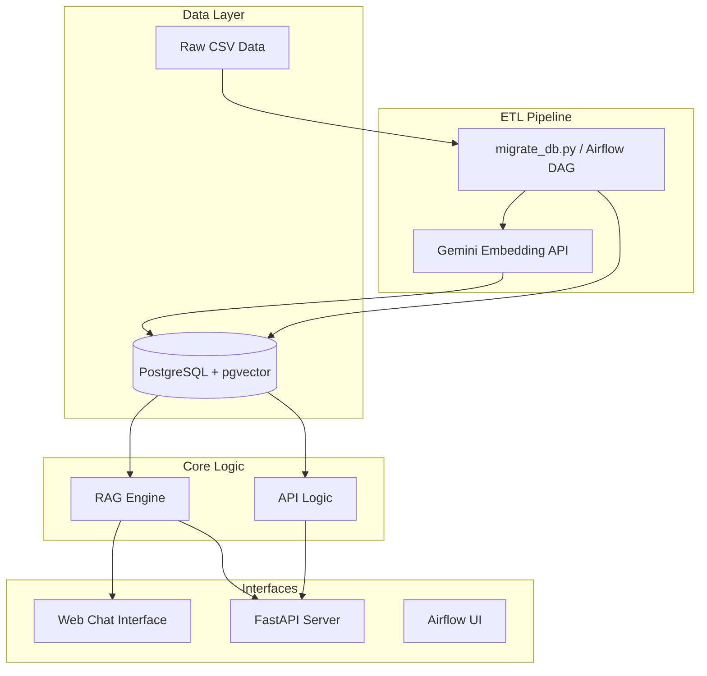
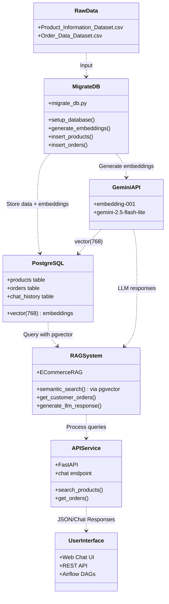

# System Architecture

This document outlines the system architecture of the E-Commerce RAG Chatbot project, including its components, data flow, and data lineage.

## System Overview

The E-Commerce RAG Chatbot is designed to provide intelligent product search and order management capabilities. The system operates in two main modes:
1.  **REST API**: A FastAPI-based service providing structured access to product and order data.
2.  **RAG Chat Interface**: A conversational assistant that uses Retrieval-Augmented Generation (RAG) with PostgreSQL + pgvector for semantic search and Google Gemini for LLM responses.

## Architecture Diagram

## Data Lineage

The following UML diagram visualizes the data lineage from raw sources to the final user interfaces.

## Component Details

### 1. Data Layer
*   **Raw Data**: Located in `data/raw/`, containing original CSV files for products and orders.
*   **PostgreSQL + pgvector**: All data stored in PostgreSQL with vector embeddings.
    *   `products` table: Product info + `embedding vector(768)`
    *   `orders` table: Order info + `embedding vector(768)`
    *   `chat_history` table: Conversation history

### 2. ETL Pipeline
*   **migrate_db.py**: Main script for data migration
    *   Loads raw CSV files
    *   Creates database schema with pgvector extension
    *   Generates embeddings via Google Gemini `embedding-001`
    *   Inserts data with embeddings into PostgreSQL
*   **Airflow DAGs** (optional):
    *   `embedding_pipeline_dag`: Scheduled embedding generation
    *   `data_ingestion_dag`: Daily data loading
    *   `maintenance_dag`: Weekly cleanup and health checks

### 3. RAG Engine (`src/rag/`)
*   **Core Logic**: Implemented in `assistant.py`.
*   **Functionality**:
    *   Performs **semantic search** using pgvector's cosine distance (`<=>` operator)
    *   Generates query embeddings via Gemini `embedding-001`
    *   Handles order queries by filtering PostgreSQL tables
    *   **Generates natural language responses** using Google Gemini LLM (gemini-2.5-flash-lite)
*   **LLM Integration**:
    *   Uses `google-generativeai` SDK to interact with Gemini
    *   Constructs prompts with user query and retrieved context
    *   Returns conversational, context-aware responses

### 4. API Service (`src/api/`)
*   **Framework**: FastAPI
*   **Endpoints**:
    *   `/api/chat`: Chat with RAG assistant
    *   `/api/products`: Product search and filtering
    *   `/api/orders`: Order queries by customer ID or priority
*   **Logic**: Queries PostgreSQL directly, uses pgvector for semantic search

### 5. Interfaces
*   **Web Chat UI**: Modern chat interface at `http://localhost:8000/static/index.html`
*   **Swagger UI**: Auto-generated API documentation at `http://localhost:8000/docs`
*   **Airflow UI**: DAG management at `http://localhost:8080` (admin/admin)
